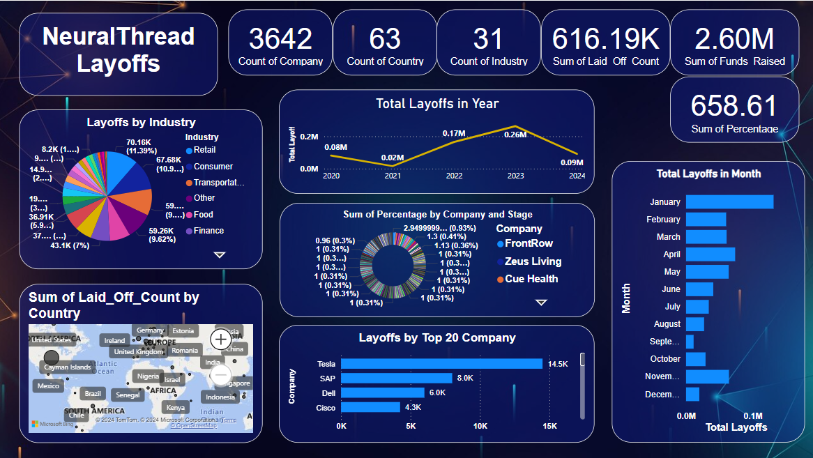

# NuralThread Layoffs Dashboard

Welcome to the NuralThread Layoffs Dashboard repository! This repository contains a Power BI dashboard created to analyze layoffs data from the layoffs_data.csv Dataset. With this dashboard, you can gain insights into various aspects of the Nuralthread Layoffs performance.



## Getting Started

To get started, follow these simple steps:

1. **Clone the Repository:** Clone this repository to your local machine using the following command:
    ```
    git clone https://github.com/Ansari-Sara/NeuralThread
    ```

2. **Download the Layoffs Dataset:** You need the Nuralthread Layoffs Dataset to create the dashboard. You can download it from [here] (https://github.com/Ansari-Sara/NeuralThread/blob/main/layoffs_data.csv). Make sure to place the dataset file in the appropriate directory within the cloned repository.

3. **Open the Power BI File:** Once you have the dataset, open the `DA-101.pbix` file using Power BI Desktop.

4. **Connect the Dataset:** In Power BI Desktop, connect to the layoffs_data Dataset that you downloaded in step 2.

5. **Explore the Dashboard:** Now that you've connected the dataset, you can explore the dashboard. Navigate through the different tabs and visuals to gain insights.
